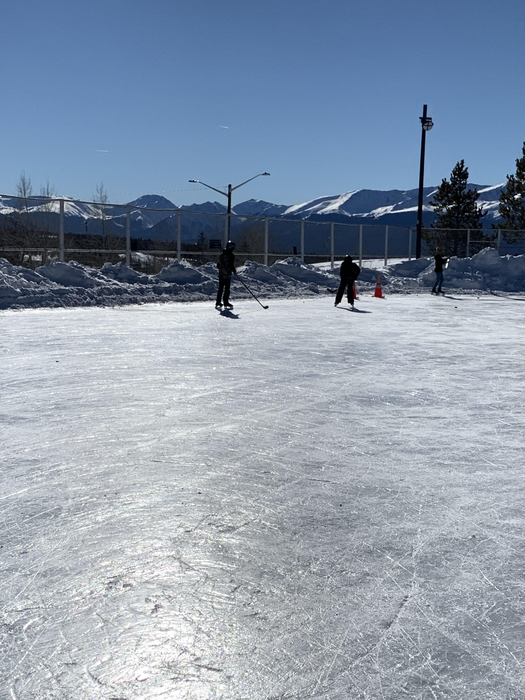
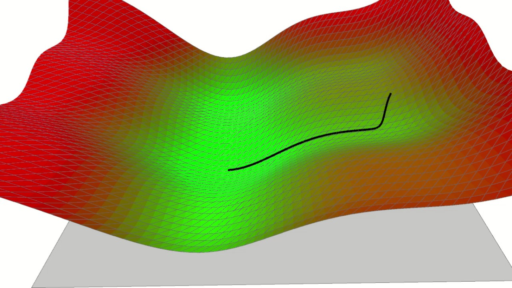
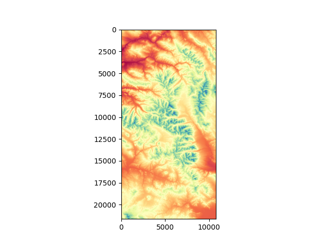
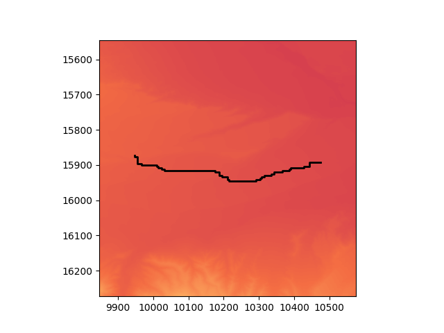
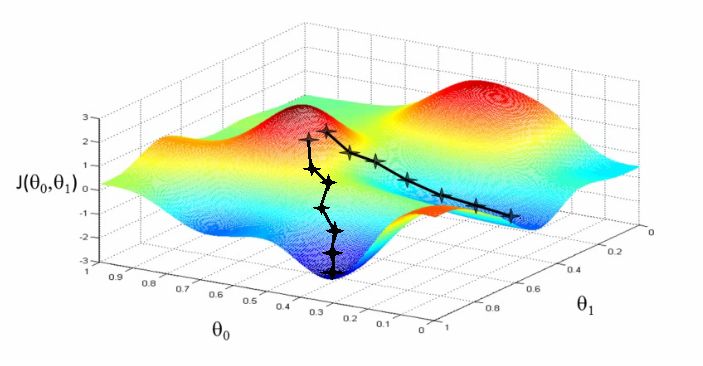

# Introduction

In programming, the term "gradient descent" has become synonmous with neural networks. Indeed, back propagation through neural networks require the gradient descent algorithm; however, many struggle when visualizing what gradient descent means. Even fewer recognize its inverse, gradient ascent. Finally, few if any recognize the preceding mathematical optimization algorithms outside of machine learning.

In this project, I implement a deterministics gradient ascent model to find the tallest mountains in Colorado. In this README, I will include my data, methods, and motivation for this project. I hope you enjoy!

# Motivation

I choose this project for three reasons. 

1. I have found no place more breathtaking than Colorado's Arkansas valley, ranging from Mt. Massive to the Collegiates of the Rocky Mountains. I mean that literally. Here is a photo of me skating on an outdoor rink in the shadow of Mt. Elbert, ghasping for air. 


2. I wanted to learn about GIS data.

3. In day-to-day coding, we rarely build algorithms from scratch, relying on many pre-made and I wanted to use my background as a math major and attempt writing an algorithm from scratch. I first gained contact with gradient descent in Calculus II at Davidson College, and it was the first time I really began to enjoy and understand math. 

4. I hope to provide people an alternative to black-box machine learning models. People often reach for "machine learning" to optimize workflows. Machine learning models, however, lack determinism and explanability. A mathematical optimization, such as gradient ascent/descent, is no black box. We can understand how and why it outputs the answers it does, and they are often remarkably precise. 

# What is Discrete Gradient Ascent/Descent?
Admittedly, the term gradient ascent/descent is complicated, so let me give an analogy. 

Imagine you wake up one day as an ant, and your mission is to find the highest point in Colorado. Your motion is limited, so your can either walk forward, left, right, or backwaerds. Being as small as an ant, you cannot look more than one yard ahead. As this ant, you will start in a random location with a longitude and a latitude. Trying to find the highest point, you look in all four directions. You move one yard to the highest point in your field of view. After walking one yard, you re-assess, looking to find a higher location. You repeat until there is no longer a higher location in you field of view. This, to your ant brain, is the hgihest point in Colorado. This algorithm you just performed is gradient ascent. 

Gradient descent is the same algorithm, but, instead of finding the highest point in your field of view, you move to the lowest point. Here is one such image showing a surface and a hypothetical ants trajectory to the lowest point. 


This image is quite simple, in the sense that it has one lowest point. Mountains, however, are complicated, since there are many peaks and valley You can see just how  Colorado mountains. 


# Methods
## Data Collection and Processing

I acquired the data from the United States Geological Survery. I combined two datasets that aligned with my desired longitude and lattitude (between 39 and 40 degrees north and 107 - 106 degrees west). I processed ```.tif``` files in two dimensional numpy arrays. I made the topological map with the following bit of code (inside of src/viz.py):
```
import matplotlib
matplotlib.use('TkAgg')

import rasterio
import numpy as np
import matplotlib.pyplot as plt

if __name__=="__main__":
    dataset = np.load("src/gis/map.npy")
    print(dataset.shape)
    print(dataset[0])
    plt.imshow(dataset[0], cmap='Spectral')
    plt.savefig("images/topology.png")
    plt.show()
```


## Software building
I implemented the gradient descent model within a class in ```src/gradient.py```. Class objects hold the numpy array ```map```. I include one method to run single gradient ascents, implementing the algorithm as was described above. I include a second function to loop through, running the ascent algorithm hundreds of times, where each run begins in a random location. I run the algorithm in this way, since it will often take many re-runs and various paths to find the hgihest point. Here is a second topological map, where each black line represents a single ascent. 

In the code, I take the longest path, just to visualize one such path taken by the algorithm, seeing its turns.

## Resutls
As you can see, this algorithm is far from perfect. Running it three
