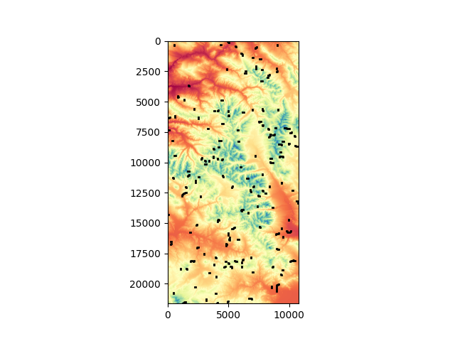

# Introduction

In programming, "gradient descent" has become synonymous with neural networks. Indeed, backpropagation through neural networks requires the gradient descent algorithm. However, many struggle with visualizing what gradient descent means, and even fewer recognize its inverse, gradient ascent. Additionally, few recognize the preceding mathematical optimization algorithms outside of machine learning.


In this project, I implement a deterministic gradient ascent model to find the tallest mountains in Colorado. This README includes my data, methods, and motivation for the project. I hope you enjoy!
# Motivation

I chose this project for several reasons:

1. I have found no place more breathtaking than Colorado's Arkansas Valley, ranging from Mt. Massive to the Collegiates of the Rocky Mountains. I mean that literally. Here is a photo of me skating on an outdoor rink in the shadow of Mt. Elbert, gasping for air. 

  

2. I wanted to learn about GIS data. 

3. In day-to-day coding, we rarely build algorithms from scratch, often relying on pre-made ones. I wanted to use my background as a math major to attempt writing an algorithm from scratch. I first encountered gradient descent in Calculus II at Davidson College, which sparked my enjoyment and understanding of math.

4. I aim to provide an alternative to black-box machine learning models. People often opt for "machine learning" to optimize workflows. However, these models lack determinism and explainability. A mathematical optimization, such as gradient ascent/descent, is no black box. We can understand its outputs and their precision.

# What is Discrete Gradient Ascent/Descent?

The term gradient ascent/descent can be complex, so let me provide an analogy.

Imagine waking up as an ant, tasked with finding the highest point in Colorado. Your movement is limited: you can walk forward, left, right, or backward, but only see one yard ahead. Starting at a random longitude and latitude, your goal is to find the highest point. You look in all four directions, move one yard to the highest point in your view, then reassess and repeat this process until no higher location is visible. This is gradient ascent.

Gradient descent follows the same algorithm, but you move to the lowest point instead. Here's an image showing a surface and a hypothetical ant's trajectory to the lowest point.  


Mountains are complex, with many peaks and valleys, as shown in this image of Colorado mountains!


# Methods

## Data Collection and Processing

The data was acquired from the United States Geological Survey, combining two datasets within 39-40 degrees north and 107-106 degrees west. The .tif files were processed into two-dimensional numpy arrays. Below is the code used to create the topological map (in src/viz.py):

```
import matplotlib
matplotlib.use('TkAgg')

import rasterio
import numpy as np
import matplotlib.pyplot as plt

if __name__=="__main__":
    dataset = np.load("src/gis/map.npy")
    print(dataset.shape)
    print(dataset[0])
    plt.imshow(dataset[0], cmap='Spectral')
    plt.savefig("images/topology.png")
    plt.show()

```

## The Algorithms
I implemented the gradient ascent model within a class in ```src/gradient.py```. Class objects hold the numpy array ```map```. I include a second function to loop through, running the ascent algorithm hundreds of times, where each run begins in a random location. I run the algorithm in this way, since it will often take many reruns and various paths to find the highest point. Here is a second topological map, where each black line represents a single ascent.



In the code, I take the longest path, just to visualize one such path taken by the algorithm, seeing its turns. In this image, you can see how the line starts in lower elevation, more in yellow, and reaches an orange zone.


# Results
As you can see, this algorithm is far from perfect. Notice that most black lines stop a long way from the highest elevation, seen in dark red. However, after 500 trials taking about 3 seconds to run, you will generally find a highest altitude around 14,000 feet — not too bad! On this run in particular, the algorithm reached 14284.66 feet, a couple hundred feet higher than the summit of Mount Elbert.

# Conclusion

Mathematical modeling rarely gets much attention in industry. As a former math major, I have tears in my eyes when I see people looking to machine learning to solve all their problems. Inevitably, however, they reject machine learning solutions for two main reasons. ML models are 1) black boxes, and 2) output contradictions. Here I present one such alternative to machine learning based optimization. (In a sense, machine learning is nothin other than statistical optimization according to a loss function, but I digress.) 

In the process, I also hope to show what I am capable of as a problem solver, implementing techniques used in GIS applications, data visualization, and mathematical optimization. I hope you enjoy this repository.
